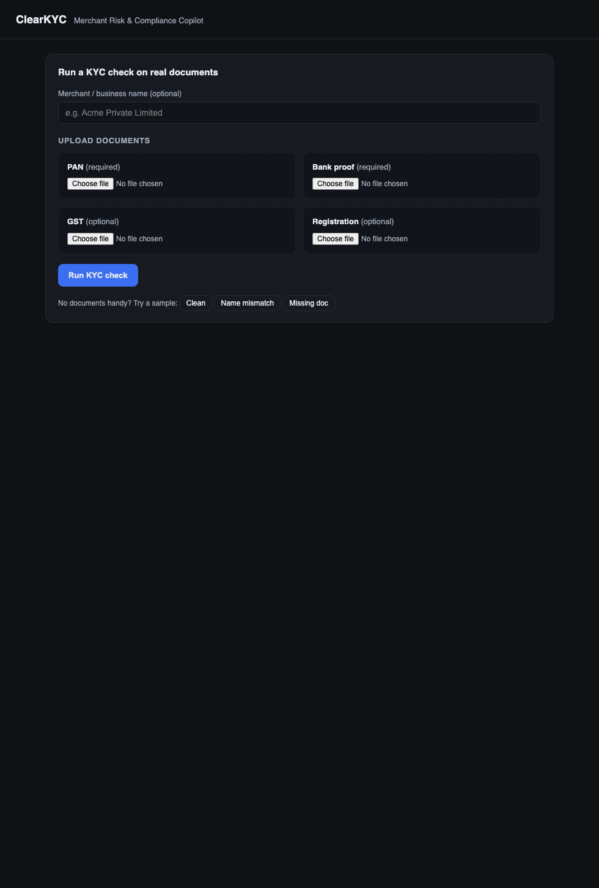
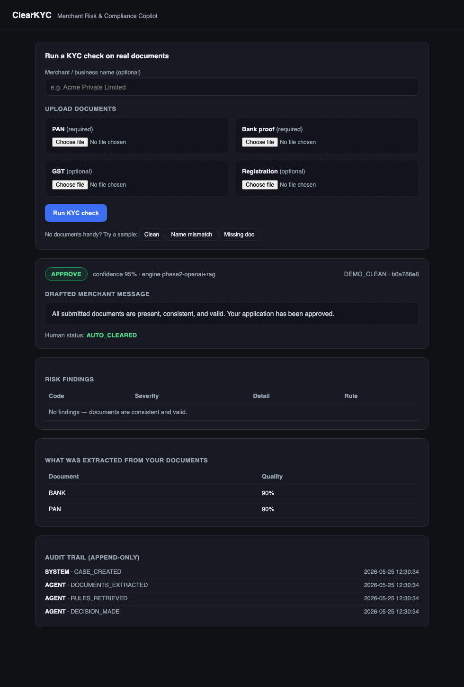
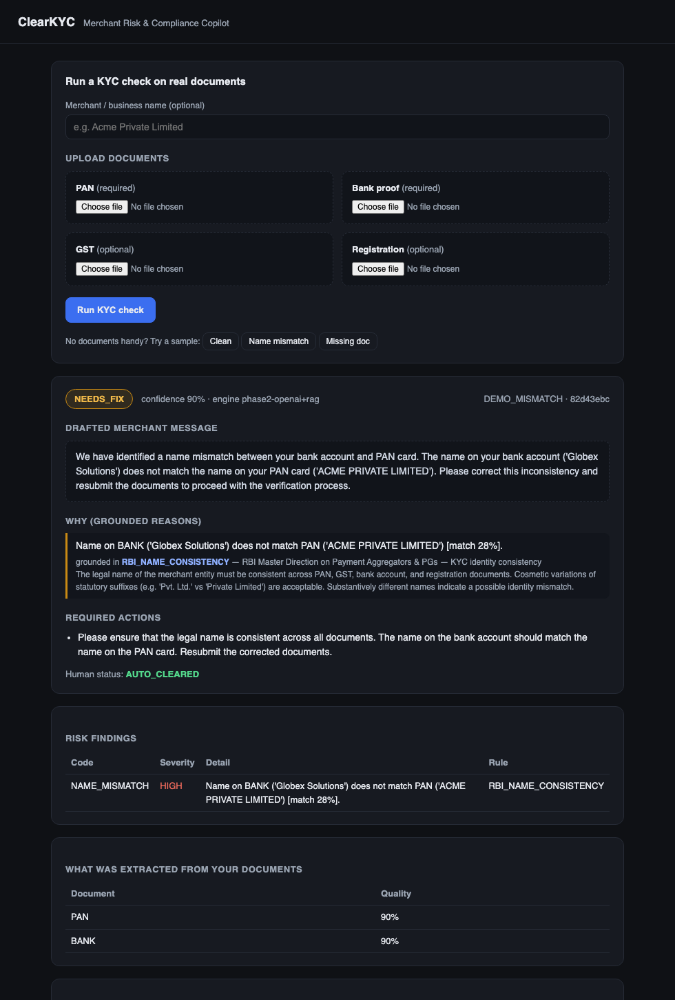
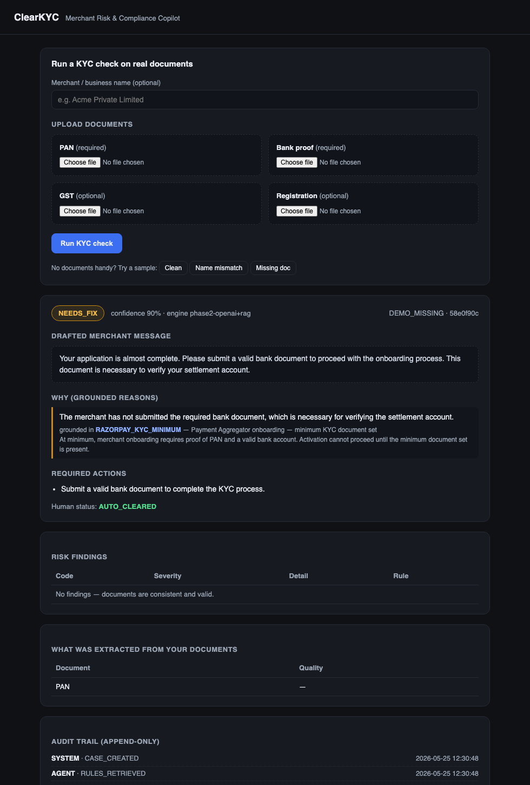
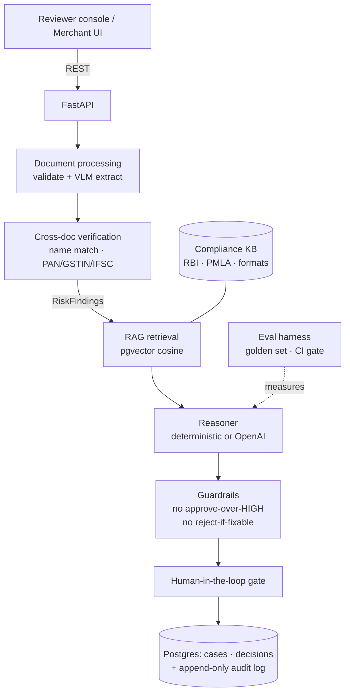

# ClearKYC — Merchant Risk & Compliance Copilot

Turns the opaque KYC / settlement-hold "black box" — Razorpay's #1 merchant
complaint — into a transparent, explainable, fast decision loop. When a merchant
is flagged, ClearKYC reads the documents, grounds its reasoning in real RBI/PMLA
rules, and returns a verdict with **specific reasons, exact fixes, a drafted
merchant message, and a full audit trail**.

See [WRITEUP.md](./WRITEUP.md) for the problem research and pitch.

## Screenshots

Upload real PAN/bank documents and run a check:



A clean merchant — cosmetic name difference ("Pvt. Ltd." vs "Private Limited"),
the case Razorpay wrongly rejects ~40% of the time — is **approved**:



A real name mismatch is **flagged with a specific, rule-grounded reason** and an
exact fix (not a generic rejection email):



A missing document is explained and grounded in the minimum-KYC rule:



## Architecture



Pluggable providers (one env var each) — all default to free/offline/deterministic:
`EXTRACTOR` `mock|openai` · `EMBEDDER` `mock|openai` · `REASONER` `rules|openai`.

## Run it

```bash
docker compose up --build -d
```

- **Reviewer console:** http://localhost:8000/ui/  ← click a scenario, see the
  grounded verdict, findings, audit trail, and approve/override.
- **API docs:** http://localhost:8000/docs
- **Narrated CLI demo:** `bash scripts/demo.sh`

### With real OpenAI (optional)
```bash
# put your key in a gitignored .env, then:
EXTRACTOR=openai EMBEDDER=openai REASONER=openai docker compose up --build -d
```

## Quality (measured, not claimed)

```bash
python -m pytest -q          # 22 tests incl. the eval gate
python evals/run_evals.py    # full report
```

Deterministic engine on the 16-case golden set:

| metric | value |
|---|---|
| verdict accuracy | **100%** |
| false-approve rate (regulatory risk) | **0%** |
| false-reject rate (merchant churn risk) | **0%** |
| name-mismatch precision / recall | **100% / 100%** |

## API

| Method | Path | Purpose |
|--------|------|---------|
| GET  | `/health` | liveness |
| GET  | `/rules` | seeded compliance KB |
| POST | `/cases` | create a merchant case |
| POST | `/cases/{id}/documents` | attach a document |
| POST | `/cases/{id}/decide` | extract → verify → RAG → reason → decide |
| GET  | `/cases/{id}` | case with documents + decisions |
| GET  | `/cases/{id}/findings` | structured risk findings |
| GET  | `/cases/{id}/audit` | append-only audit trail |
| POST | `/decisions/{id}/review` | human-in-the-loop approve/override |
| POST | `/demo/{scenario}` | one-shot demo (`clean`/`mismatch`/`missing`) |

## Design decisions (the why)

- **Postgres + pgvector** — one store for relational data and rule embeddings.
- **Structured, cited decisions** — every reason carries a rule citation;
  explainability is structural, not a free-text LLM afterthought.
- **Append-only audit log** — tamper-evident trail (RBI requirement).
- **Two-layer safety** — a deterministic guardrail sits over *any* reasoner, so
  an over-eager LLM can never approve a bad case or permanently reject a fixable
  one.
- **Evals as a CI gate** — regressions in false-approve/false-reject fail the build.

## Tech

FastAPI · SQLAlchemy 2.0 · Postgres/pgvector · OpenAI (vision/embeddings/reasoning)
· rapidfuzz · Docker Compose · Python 3.13.

## Build phases

- **0** walking skeleton · **1** vision extraction + matching engine ·
  **2** RAG-grounded agentic reasoning + guardrails · **3** eval harness + golden
  set · **4** reviewer console + packaging.
